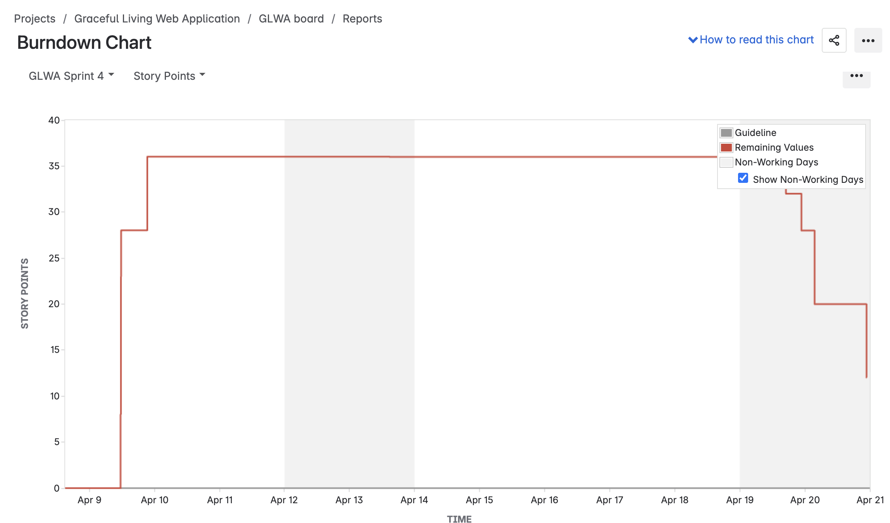

## 🌿 GracefuLiving Web Application
> Designed and developed by Team Bit-by-Bit for CSC 190 and 191 Capstone.<br>
> **Client**: Shante Kumar "Coach Tay", Holistic Life Coach and Founder of GracefuLiving Coaching Services.<br>

---

## 📝 Project Description

GracefuLiving is a comprehensive, full-stack web application designed to support holistic wellness coaching services. Built with modern web technologies, the platform provides an intuitive interface for clients to engage with wellness resources, book coaching sessions, take personalized assessments, and shop for wellness products. The application features a robust admin portal with analytics dashboards, conversion statistics, and client filtering capabilities based on pre-application quiz results. Administrators can dynamically manage all website content including carousel slides, testimonials, resources, and services. The platform seamlessly integrates with Google Calendar and Zoom for appointment scheduling, features two machine learning models for conversion prediction and chakra trend forecasting, and maintains a secure, scalable architecture using MongoDB Atlas for data persistence.

---

## 🎯 What the Application Does

GracefuLiving serves as a complete digital platform for holistic wellness coaching with the following key features:

### For Clients:
- **Chakra Wellness Assessment**: Take a personalized quiz to assess chakra balance and receive tailored recommendations
- **Pre-Application Form**: Complete a comprehensive intake form before booking appointments
- **Appointment Booking**: Schedule coaching sessions with real-time availability, Google Calendar integration, and automatic Zoom meeting creation
- **Service Discovery**: Browse and learn about various holistic services including Kundalini Yoga, Sound Baths, Life Coaching, and Emotional Freedom Technique
- **Resource Library**: Access curated wellness content, articles, and downloadable resources
- **Shop**: Browse and purchase wellness products and services with integrated payment processing
- **Testimonials**: Read client reviews and success stories

### For Administrators:
- **Content Management System**: Dynamically manage homepage carousel slides, testimonials, resources, and service descriptions
- **Appointment Management**: View, update, and manage all client appointments with status tracking
- **Availability Configuration**: Set weekly availability schedules, time slots, and block dates for holidays/vacations
- **Client Management**: View and manage client information, applications, and assessment results
- **Client Filtering**: Filter and search potential clients based on pre-application quiz responses and assessment data
- **Analytics Dashboard**: View conversion statistics, trend predictions, and chakra assessment analytics with Chart.js visualizations
- **Statistics Portal**: Access detailed conversion metrics, appointment statistics, and client engagement analytics
- **Email Integration**: Send confirmation emails and notifications to clients
- **Database Administration**: Secure access to MongoDB database for data management

---

## 💡 Why the Application Was Created

The GracefuLiving web application was created to address the specific needs of Coach Tay, a holistic life coach who required a professional, accessible platform to:

1. **Streamline Client Engagement**: Coach Tay previously used Calendly for booking, but needed a custom solution that avoided unnecessary features and integrated seamlessly with her workflow. We built a tailored appointment booking system that integrates with Google Calendar and Zoom, giving her full control over the booking experience while eliminating reliance on third-party services she doesn't use.
2. **Personalize Client Experience**: Provide tools like the Chakra Wellness Assessment to offer personalized recommendations and track client progress
3. **Empower Content Control**: Give Coach Tay full administrative control over website content without requiring technical knowledge or developer intervention
4. **Build Client Relationships**: Store and manage client information, applications, and assessment data to better understand and serve clients. Filter potential clients based on pre-application quiz responses to identify the best matches for her services.
5. **Professional Digital Presence**: Establish a modern, mobile-responsive web presence that reflects the brand's holistic wellness values
6. **Data-Driven Insights**: Leverage machine learning models to predict client conversion likelihood and forecast next chakra trends, enabling Coach Tay to optimize engagement strategies and anticipate client needs

The application bridges the gap between traditional wellness coaching and modern digital tools, enabling Coach Tay to scale her practice while maintaining the personal, holistic approach that defines her brand.

---

## 🖼️ Screenshots

### Homepage

*The welcoming homepage features a dynamic carousel showcasing services, inspirational quotes, and easy navigation to key features.*

### Chakra Assessment

*The interactive Chakra Wellness Quiz guides users through personalized questions to assess their spiritual and emotional balance.*

### Appointment Booking

*Clients can view available time slots, select their preferred date and time, and book appointments with automatic calendar integration.*

### Admin Dashboard

*The comprehensive admin portal provides tools for managing appointments, content, clients, and viewing analytics.*

### About Us Page

*The About Us page introduces Coach Tay, her background, philosophy, and approach to holistic wellness coaching, providing visitors with insight into her journey and expertise.*

---

## 👥 Team Members (Contributors)

**Team Bit-by-Bit**

- **Daniela Perez** - danielaperez3@csus.edu - https://github.com/daniperezg
- **Terry Weatherman** - tweatherman@csus.edu - https://github.com/Lildel81
- **Hadia Amiri** - hamiri@csus.edu - https://github.com/amirihadia
- **Rafael Mejia** - rmejia2@csus.edu - https://github.com/rafaelmejia2
- **Henna Sandhu** - hennabatoolsandhu@csus.edu - https://github.com/Hennnsandhu
- **Jocelyn Camacho** - jocelyncamachonunez@csus.edu - https://github.com/jcamachonunez
- **Oanh Dingle** - oanhtrandingle@csus.edu - https://github.com/O-Dingle
- **Cong Ho** - congho@csus.edu - https://github.com/C0ngH0
  
---

## 🧪 Testing

The application includes comprehensive testing using Jest for unit and integration tests.

### Running Unit and Integration Tests

```bash
# Run all tests
npm test

# Run tests in watch mode (automatically re-runs on file changes)
npm test -- --watchAll

```
### System Tests (Selenium)

System tests use Selenium WebDriver with pytest to perform end-to-end browser testing.

**Prerequisites:**
- Python 3.8 or higher
- Chrome browser installed (or Firefox for FirefoxDriver)
- ChromeDriver installed and in PATH (or GeckoDriver for Firefox)

**Setup and Run:**

1. **Clone the Selenium Testing repository:**
   ```bash
   git clone https://github.com/Lildel81/Selenium-Testing.git
   cd Selenium-Testing
   ```

2. **Create and activate a virtual environment:**
   ```bash
   python3 -m venv venv
   source venv/bin/activate  # On Windows: venv\Scripts\activate
   ```

3. **Install dependencies:**
   ```bash
   pip install -r requirements.txt
   ```
   Or install manually:
   ```bash
   pip install pytest selenium webdriver-manager
   ```

4. **Ensure the application is running:**
   - Start the main application on `http://localhost:8080` (or your configured port)
   - Make sure the database is connected and accessible

5. **Run all tests:**
   ```bash
   pytest
   ```

6. **Run specific test file:**
   ```bash
   pytest tests/test_homepage.py
   ```

7. **Run with verbose output:**
   ```bash
   pytest -v
   ```

8. **Run with detailed output and print statements:**
   ```bash
   pytest -v -s
   ```

9. **Run specific test by name:**
   ```bash
   pytest -k "test_name"
   ```

**Note:** Make sure ChromeDriver is installed and accessible in your system PATH, or use `webdriver-manager` which automatically handles driver installation.

### Test Structure

- **Unit Tests**: Located in `controllers/__test__/` directory
  - Example: `10-24-2025-carouselController.unit.test.js` - Tests individual controller functions in isolation
- **Integration Tests**: Test complete request/response cycles
  - Example: `10-30-2025-carouselController.integration.test.js` - Tests full API endpoints with database interactions
- **System Tests (End-to-End)**: Test complete user workflows and system interactions
  - Integration tests that verify end-to-end functionality across multiple components
  - Tests complete user journeys from frontend to backend to database
- **Manual Testing**:
  - Postman: API endpoints can be tested using Postman collections
  - Browser Testing: Test user flows through the web interface
  - Admin Portal: Test content management features through the admin dashboard

---

## 🚀 Download, Setup, and Deployment Instructions

### Prerequisites

Before setting up the application, ensure you have the following installed:
- **Node.js** (v14 or higher)
- **npm** (Node Package Manager)
- **MongoDB Atlas account** (or local MongoDB instance)
- **Git**

### Download and Installation

1. **Clone the repository:**
   ```bash
   git clone https://github.com/Lildel81/Graceful-Living-Web-Application.git
   cd Graceful-Living-Web-Application
   ```

2. **Install dependencies:**
   ```bash
   npm install
   ```

3. **Set up environment variables:**
   Create a `.env` file in the root directory with the following variables:
   ```bash
   PORT=8080
   HOST=localhost
   HOST_URL=http://localhost:8080
   MONGODB_URI=your_mongodb_connection_string
   SESSION_SECRET=your_session_secret_key
   GOOGLE_CLIENT_ID=your_google_client_id
   GOOGLE_CLIENT_SECRET=your_google_client_secret
   GOOGLE_REDIRECT_URI=your_google_redirect_uri
   ZOOM_CLIENT_ID=your_zoom_client_id
   ZOOM_CLIENT_SECRET=your_zoom_client_secret
   ZOOM_REDIRECT_URI=your_zoom_redirect_uri
   STRIPE_SECRET_KEY=your_stripe_secret_key
   STRIPE_PUBLISHABLE_KEY=your_stripe_publishable_key
   EMAIL_HOST=your_email_host
   EMAIL_USER=your_email_username
   EMAIL_PASS=your_email_password
   ML_API_URL=your_ml_api_url
   ```

4. **Set up MongoDB:**
   - Create a MongoDB Atlas account or use a local MongoDB instance
   - Update the `MONGODB_URI` in your `.env` file
   - The application will automatically create collections on first run

5. **Set up Machine Learning APIs (Optional):**
   
   **Conversion Prediction Model (ml_model folder):**
   ```bash
   cd ml_model
   python3 -m venv venv
   source venv/bin/activate  # On Windows: venv\Scripts\activate
   pip install -r requirements_api.txt
   ```
   
   **Chakra Trend Prediction Model (python folder):**
   ```bash
   cd python
   python3 -m venv venv
   source venv/bin/activate  # On Windows: venv\Scripts\activate
   pip install -r requirements.txt
   ```

### Running Locally

1. **Start the main application:**
   ```bash
   npm start
   ```
   The application will be available at `http://localhost:8080`

2. **Start the Machine Learning APIs (if using ML features):**
   
   **Start Conversion Prediction API (ml_model folder):**
   ```bash
   cd ml_model
   source venv/bin/activate  # On Windows: venv\Scripts\activate
   python3 ml_api.py
   ```
   
   **Start Chakra Trend Prediction API (python folder):**
   ```bash
   cd python
   source venv/bin/activate  # On Windows: venv\Scripts\activate
   python app.py
   ```

### Deployment

#### Production Deployment Steps

1. **Prepare environment:**
   - Set `NODE_ENV=production` in your `.env` file
   - Update `HOST_URL` to your production domain
   - Ensure all API keys and secrets are configured

2. **Build and optimize:**
   ```bash
   npm install --production
   ```

3. **Deploy to hosting platform:**
   - **Render**: 
     - Connect your GitHub repository to Render
     - Create a new Web Service
     - Set build command: `npm install`
     - Set start command: `npm start`
     - Add all environment variables from your `.env` file in the Render dashboard
     - For ML APIs, create separate Web Services for each:
       - **Conversion Model**: 
         - Root directory: `ml_model`
         - Build command: `pip install -r requirements_api.txt`
         - Start command: `gunicorn -c gunicorn_config.py ml_api:app`
       - **Trend Model**: 
         - Root directory: `python`
         - Build command: `pip install -r requirements.txt`
         - Start command: `gunicorn -c gunicorn_config.py app:app`
   
4. **Set up MongoDB Atlas:**
   - Configure production database cluster
   - Set up IP whitelist and database user
   - Update connection string in production environment

5. **Configure domain and SSL:**
   - Point your domain to the hosting server
   - Set up SSL certificate (Let's Encrypt recommended)

---

### 🛠 Tech Stack
|   Layer     | Technology                                |
|-------------|-------------------------------------------|
| Frontend    | HTML, CSS, EJS, JavaScript                |
| Backend     | Node.js, Express.js                       |
| Database    | MongoDB (Atlas), Mongoose ODM             |
| Testing     | Jest, Supertest, MongoDB Memory Server, Selenium   |
| Machine Learning | Python, Flask, scikit-learn, Pandas    |
| Tools       | Multer, bcrypt, express-session, Chart.js, Helmet, CSRF |
| Integrations| Google Calendar API, Zoom API, Stripe    |
| Versioning  | Git, GitHub                               |
| API Test    | Postman                                   |
| Hosting     | MongoDB Atlas (AWS), GoDaddy domain       |

---

## 🖼️ Entity Relationship Diagram (ERD)


---

## 🎬 Video Walkthrough
**Client Side**
<div>
    <a href="https://www.loom.com/share/292d15b3834149459ef0b8c3e4450c27">
      <p>User Side - Watch Video</p>
    </a>
    <a href="https://www.loom.com/share/292d15b3834149459ef0b8c3e4450c27">
      
    </a>
  </div>

<br>

**Admin Side**
<div>
    <a href="https://www.loom.com/share/60480669c9674e109de9fa9267b989a4">
      <p>Admin Side - Watch Video</p>
    </a>
    <a href="https://www.loom.com/share/60480669c9674e109de9fa9267b989a4">
      
    </a>
  </div>
---
## 🔗 JiRA & GitHub Repository
### 



### 

---
## 💬  Client Feedback
> Coach Tay is highly satisfied with the website's design, user interface, and intuitive navigation.<br>
> She plans to replace Calendly with the custom booking feature integrated into the website, as it better aligns with her workflow and eliminates unnecessary third-party dependencies.<br>
> She appreciates the comprehensive statistics from the chakra assessment and values the machine learning models that provide insights on potential client conversion and chakra trend forecasting.<br>

---

## 🔮 Future Enhancements

The following enhancements are planned to ensure a smooth transition and full ownership transfer to Coach Tay:

- **Database Migration**: Migrate the current development database to a new production database with Coach Tay's own MongoDB Atlas credentials, ensuring she has full control and ownership of all client data.

- **API Configuration**: Set up and configure all third-party API integrations with Coach Tay's credentials:
  - Google Calendar API for appointment scheduling
  - Zoom API for virtual meeting creation
  - Stripe API for payment processing
  - Email service API for notifications

- **Administrative Training and Support**: Provide comprehensive training sessions and documentation to help Coach Tay become familiar with administering the website, including:
  - Content management workflows
  - Appointment and client management
  - Analytics and reporting features
  - Troubleshooting common issues
  - Ongoing support during the transition period before full delivery

---

## 🙏 Acknowledgements
Special thanks to:
- Professor Kenneth Elliott
- Lab Advisor Gary Kane
- Coach Tay for her collaboration


