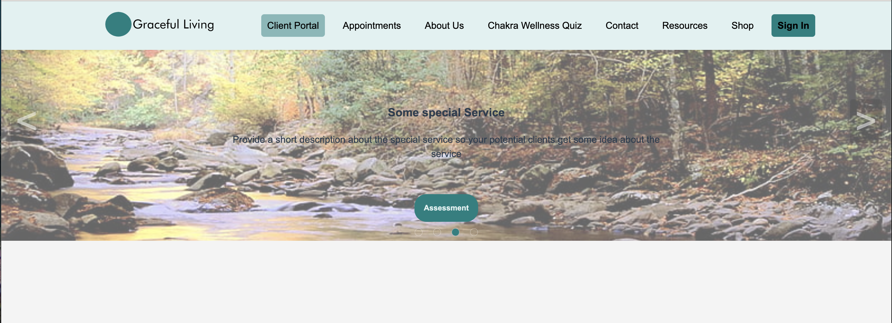
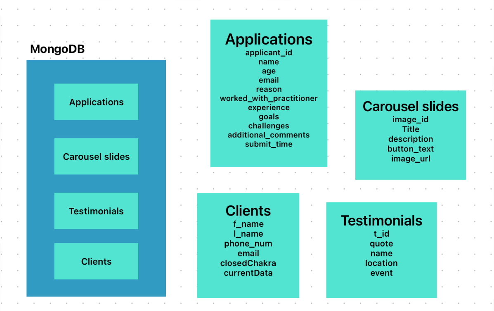
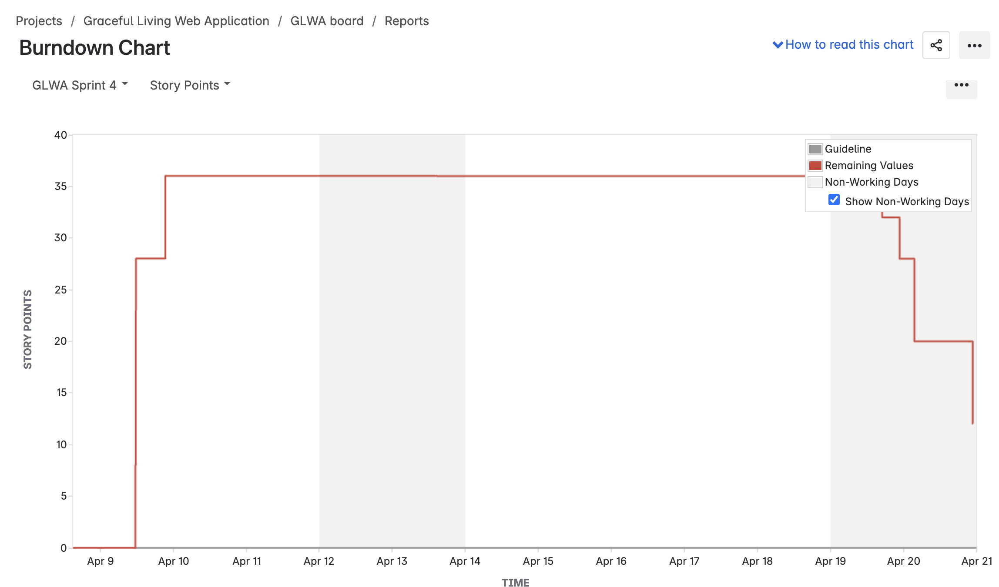
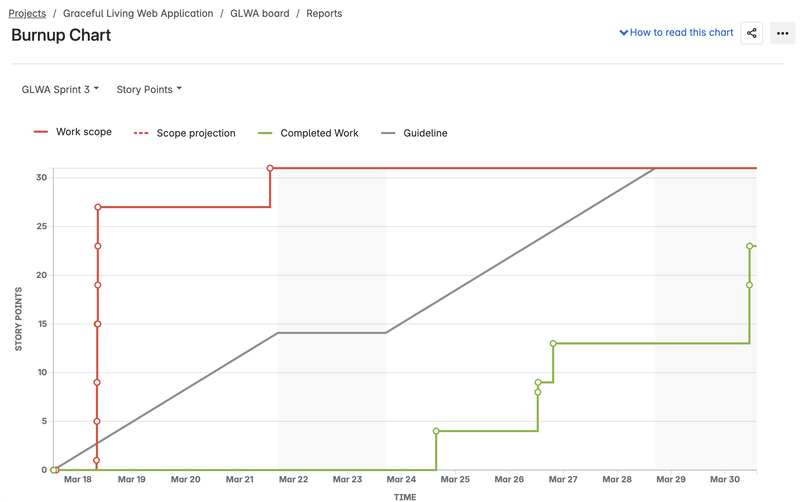

## 🌿 GracefuLiving Web Application
> Designed and developed by Team Bit-by-Bit for CSC 190 and 191 Capstone.<br>
> **Client**: Shante Kumar "Coach Tay", Holistic Life Coach and Founder of GracefuLiving Coaching Services.<br>

---
## 🧠 Client Problem & Our Solution
### Problem
Coach Tay needed an accessible, holistic platform with personalized engagement tools and admin control over content and clients.

### Solution
Team Bit-by-Bit created a scalable, mobile-friendly, admin-powered web platform tailored to her brand and goals - including Chakra wellness tools and a dynamic content system.

---
## 🙌  Team Bit-by-Bit
- Daniela Perez
- Terry Weatherman
- Hadia Amiri
- Rafael Mejia
- Henna Sandhu
- Jocelyn Camacho
- Oanh Dingle
- Cong Ho
---
## 🔮 Project Synopsis

GracefuLiving is a holistic wellness platform that allows users to:
- Take a personalized Chakra Wellness Quiz
- Learn about spiritual and lifestyle services
- Schedule coaching sessions
- Explore insightful content on health and well-being

### 🌟 Admin can:
- Manage web content dynamically, such as homepage carousel, resources, testimonials,...
- Handle session data, client contact form, and Chakra quiz
- View and maintain a secure, cloud-hosted MongoDB database
Our goal is to deliver a custom-built, user-friendly web experience aligned with Coach Tay's vision and brand identity.

---

## 🧪 Testing (Coming in CSC 191)

---

## 🚀 Deployment (Coming in CSC 191)

---

## 👩‍💻 Developer Instructions

### 🔧 Local Setup
```bash
git clone https://github.com/Lildel81/Graceful-Living-Web-Application.git
cd Graceful-Living-Web-Application
npm install
npm start
```
### 💾 Environment Variables (.env)
```bash
PORT=8080
HOST=localhost
HOST_URL=http://localhost:8080
```
### 🛠 Tech Stack
|   Layer     | Technology                                |
|-------------|-------------------------------------------|
| Frontend    | HTML, CSS, EJS, JavaScript                |
| Backend     | Node.js, Express.js                       |
| Database    | MongoDB (Atlas), Mongoose ODM             |
| Tools       | Multer, bcrypt, express-sessiom, Chart.js |
| Versioning  | Git, GitHub                               |
| API Test    | Postman                                   |
| Hosting     | MongoDB Atlas (AWS), GoDaddy domain       |

---

## 🖼️ Entity Relationship Diagram (ERD)


---

## 🎬 Video Walkthrough
<div>
    <a href="https://www.loom.com/share/caf5ede3d3c948f5a08439d4036e2e73">
    </a>
    <a href="https://www.loom.com/share/caf5ede3d3c948f5a08439d4036e2e73">
      
    </a>
</div>

---
## 🔗 JiRA & GitHub Repository
### 



### 

---

## 📅  Project Timeline (Planned for CSC 191)

| Sprint | Date (Est.) | Tasks |
|--------|-------------|-------|
| Sprint 5 | September | Finalize and update website content (text, images, links) |
| | Complete remaining UI design components for all public-facing pages |
| Sprint 6 | September - October | Implement admin login and authentication system|
| | Develop functionality to create, store, and manage admin credentials securely |
| Sprint 7 | October - November | Build and test admin portal features|
| | Add capability for admins to send emails and distribute newsletters to users|
| Sprint 8 | November | Polish UI across all pages for consistency and responsiveness| 
| | Optimize database schema and clean up unused or temporary data|

---
## 💬  Client Feedback
> Client would like the ability to swap out images and testimonials on the site.<br>
> Requested a pre-application form for her clients before booking appointments.<br>
> She wants a database to store contac information from client inquiries for future email outreach.<br>

---
## 🙏 Acknowledgements
Special thanks to:
- Professor Kenneth Elliott
- Coach Tay for her collaboration


